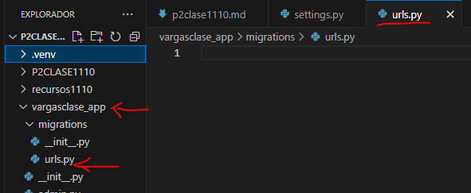
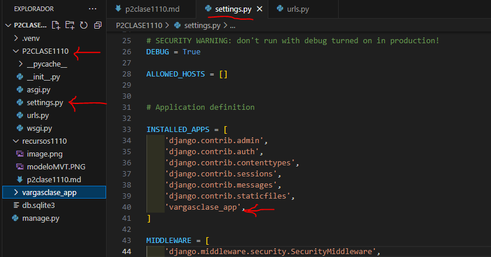
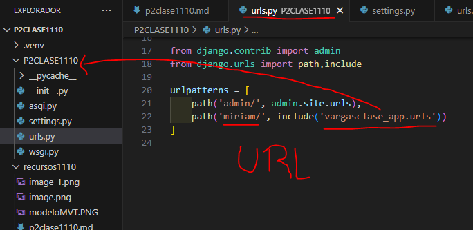
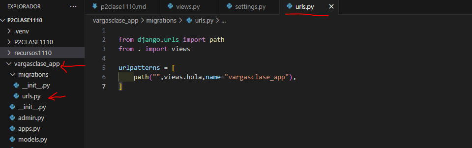
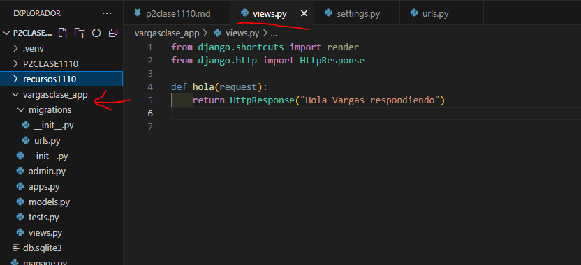

- Crear aplicacion vargasclase_app
- comando --> python manage.py startapp vargasclase_app
- 
- En settings.py de p2clase1110
- 
- En urls.py de p2clase1110
- 
- En urls.py en vargasclase_app
-
- En views.py en vargasclase_app
-